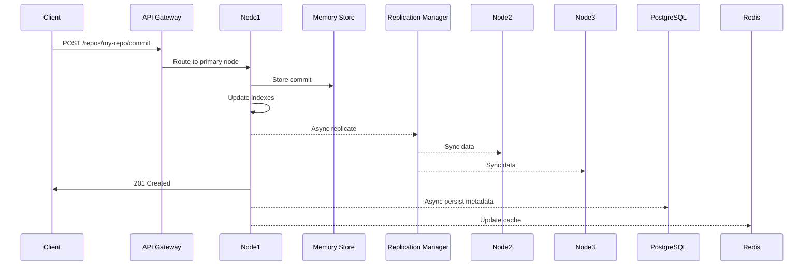
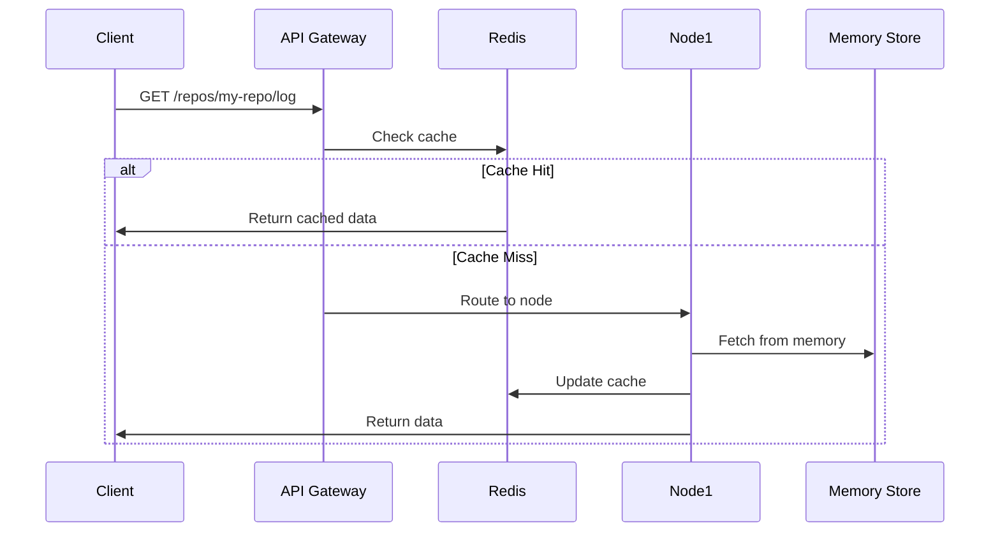

# govc Architecture Design

## Overview

govc is designed as a distributed, memory-first Git platform that can scale from a single node to a global cluster while maintaining sub-millisecond performance for most operations.

```
┌─────────────────────────────────────────────────────────────┐
│                        Load Balancer                         │
│                    (HAProxy/Nginx/Cloud LB)                  │
└─────────────────┬───────────────────────┬───────────────────┘
                  │                       │
┌─────────────────▼───────┐     ┌────────▼────────────────────┐
│      API Gateway        │     │       API Gateway           │
│   (Kong/Envoy/Custom)   │     │   (Kong/Envoy/Custom)       │
│  • Rate Limiting        │     │  • Rate Limiting            │
│  • Auth/JWT Validation  │     │  • Auth/JWT Validation      │
│  • Request Routing      │     │  • Request Routing          │
└─────────────┬───────────┘     └──────────┬──────────────────┘
              │                            │
┌─────────────▼───────────────────────────▼───────────────────┐
│                      govc Cluster Nodes                      │
│  ┌─────────────┐  ┌─────────────┐  ┌─────────────┐        │
│  │   Node 1    │  │   Node 2    │  │   Node 3    │  ...   │
│  │ ┌─────────┐ │  │ ┌─────────┐ │  │ ┌─────────┐ │        │
│  │ │ API     │ │  │ │ API     │ │  │ │ API     │ │        │
│  │ │ Server  │ │  │ │ Server  │ │  │ │ Server  │ │        │
│  │ └────┬────┘ │  │ └────┬────┘ │  │ └────┬────┘ │        │
│  │      │      │  │      │      │  │      │      │        │
│  │ ┌────▼────┐ │  │ ┌────▼────┐ │  │ ┌────▼────┐ │        │
│  │ │ Repo    │ │  │ │ Repo    │ │  │ │ Repo    │ │        │
│  │ │ Manager │ │  │ │ Manager │ │  │ │ Manager │ │        │
│  │ └────┬────┘ │  │ └────┬────┘ │  │ └────┬────┘ │        │
│  │      │      │  │      │      │  │      │      │        │
│  │ ┌────▼────┐ │  │ ┌────▼────┐ │  │ ┌────▼────┐ │        │
│  │ │ Memory  │ │  │ │ Memory  │ │  │ │ Memory  │ │        │
│  │ │ Store   │ │  │ │ Store   │ │  │ │ Store   │ │        │
│  │ └─────────┘ │  │ └─────────┘ │  │ └─────────┘ │        │
│  └─────────────┘  └─────────────┘  └─────────────┘        │
└──────────────────────┬──────────────────────────────────────┘
                       │
        ┌──────────────┼──────────────────┐
        │              │                  │
┌───────▼──────┐ ┌─────▼─────┐ ┌─────────▼─────────┐
│    Redis     │ │PostgreSQL │ │   Object Store    │
│   Cluster    │ │  Cluster  │ │  (S3/MinIO/GCS)  │
│              │ │           │ │                   │
│ • Cache      │ │ • Metadata│ │ • Large Files     │
│ • Pub/Sub    │ │ • Indexes │ │ • Snapshots       │
│ • Sessions   │ │ • Audit   │ │ • Backups         │
└──────────────┘ └───────────┘ └───────────────────┘
```

## Core Components

### 1. API Gateway Layer
- **Purpose**: Entry point for all client requests
- **Responsibilities**:
  - SSL termination
  - Authentication (JWT validation)
  - Rate limiting and throttling
  - Request routing to appropriate nodes
  - API versioning
  - Request/response transformation

### 2. govc Node Architecture

Each govc node is a self-contained unit that can handle requests independently:

```go
type Node struct {
    ID           string
    Address      string
    Region       string
    Capacity     NodeCapacity
    Repositories map[string]*Repository
    Cluster      *ClusterManager
    Metrics      *MetricsCollector
}

type NodeCapacity struct {
    MaxRepos      int
    MaxMemory     int64
    MaxCPU        float64
    CurrentLoad   float64
}
```

### 3. Repository Distribution

Repositories are distributed across nodes using consistent hashing:

```go
type ConsistentHash struct {
    circle       map[uint32]string
    virtualNodes int
    nodes        []string
}

func (ch *ConsistentHash) GetNode(repoID string) string {
    hash := ch.hash(repoID)
    // Find the first node with hash >= repo hash
    for i := 0; i < len(ch.sortedHashes); i++ {
        if ch.sortedHashes[i] >= hash {
            return ch.circle[ch.sortedHashes[i]]
        }
    }
    return ch.circle[ch.sortedHashes[0]]
}
```

### 4. Memory Store Architecture

Each node maintains repositories in memory with intelligent eviction:

```go
type MemoryStore struct {
    repos      map[string]*Repository
    lru        *LRUCache
    maxMemory  int64
    usedMemory int64
}

type LRUCache struct {
    capacity int
    cache    map[string]*list.Element
    list     *list.List
}

// Eviction strategy
func (ms *MemoryStore) evictIfNeeded() {
    for ms.usedMemory > ms.maxMemory {
        victim := ms.lru.RemoveLRU()
        ms.spillToDisk(victim)
    }
}
```

### 5. Replication Strategy

Each repository is replicated across N nodes for high availability:

```go
type ReplicationManager struct {
    factor      int // Number of replicas
    strategy    ReplicationStrategy
    syncChannel chan SyncEvent
}

type ReplicationStrategy interface {
    SelectReplicas(nodeList []Node, repoID string, count int) []Node
    SyncRepository(primary Node, replicas []Node, repoID string) error
}

// Multi-region replication
type GeoReplicationStrategy struct {
    regions []string
}

func (g *GeoReplicationStrategy) SelectReplicas(nodes []Node, repoID string, count int) []Node {
    // Select one replica from each region
    replicasByRegion := make(map[string][]Node)
    // ... distribution logic
}
```

## Data Flow

### 1. Write Operations



### 2. Read Operations



## Storage Layers

### 1. Memory Layer (Hot Data)
- Active repositories
- Recent commits
- Staging areas
- Transaction state

### 2. Redis Layer (Warm Data)
- Frequently accessed metadata
- Session state
- Distributed locks
- Pub/Sub for real-time events

### 3. PostgreSQL (Cold Data)
- Repository metadata
- User information
- Audit logs
- Search indexes

### 4. Object Storage (Archive)
- Large files
- Old commits
- Backups
- Snapshots

## Scaling Strategies

### 1. Horizontal Scaling

```yaml
# kubernetes/govc-deployment.yaml
apiVersion: apps/v1
kind: Deployment
metadata:
  name: govc-node
spec:
  replicas: 10
  selector:
    matchLabels:
      app: govc
  template:
    spec:
      containers:
      - name: govc
        image: govc:latest
        resources:
          requests:
            memory: "4Gi"
            cpu: "2"
          limits:
            memory: "8Gi"
            cpu: "4"
```

### 2. Auto-scaling Rules

```go
type AutoScaler struct {
    minNodes     int
    maxNodes     int
    targetCPU    float64
    targetMemory float64
}

func (as *AutoScaler) ShouldScaleUp(metrics ClusterMetrics) bool {
    return metrics.AvgCPU > as.targetCPU || 
           metrics.AvgMemory > as.targetMemory
}

func (as *AutoScaler) ShouldScaleDown(metrics ClusterMetrics) bool {
    return metrics.AvgCPU < as.targetCPU*0.5 && 
           metrics.AvgMemory < as.targetMemory*0.5
}
```

### 3. Geographic Distribution

```go
type GeoRouter struct {
    regions map[string][]*Node
}

func (gr *GeoRouter) RouteRequest(clientIP string, repoID string) *Node {
    clientRegion := gr.getRegion(clientIP)
    
    // Try to find repo in same region
    if nodes, ok := gr.regions[clientRegion]; ok {
        for _, node := range nodes {
            if node.HasRepository(repoID) {
                return node
            }
        }
    }
    
    // Fallback to consistent hash
    return gr.consistentHash.GetNode(repoID)
}
```

## High Availability

### 1. Leader Election

Using Raft consensus for cluster coordination:

```go
type RaftNode struct {
    raft     *raft.Raft
    fsm      *RepositoryFSM
    logStore raft.LogStore
    stable   raft.StableStore
}

type RepositoryFSM struct {
    repositories map[string]*Repository
    mu           sync.RWMutex
}

func (r *RepositoryFSM) Apply(log *raft.Log) interface{} {
    var cmd Command
    json.Unmarshal(log.Data, &cmd)
    
    switch cmd.Type {
    case "CREATE_REPO":
        return r.createRepository(cmd.Data)
    case "DELETE_REPO":
        return r.deleteRepository(cmd.Data)
    // ... other operations
    }
}
```

### 2. Failure Detection

```go
type HealthChecker struct {
    nodes    map[string]*NodeHealth
    interval time.Duration
}

type NodeHealth struct {
    LastSeen     time.Time
    Failures     int
    Status       NodeStatus
    ResponseTime time.Duration
}

func (hc *HealthChecker) checkNode(node *Node) {
    ctx, cancel := context.WithTimeout(context.Background(), 5*time.Second)
    defer cancel()
    
    resp, err := node.HealthCheck(ctx)
    if err != nil {
        hc.markUnhealthy(node)
        hc.triggerFailover(node)
    } else {
        hc.updateHealth(node, resp)
    }
}
```

### 3. Automatic Failover

```go
type FailoverManager struct {
    cluster *ClusterManager
    locks   *DistributedLockManager
}

func (fm *FailoverManager) HandleNodeFailure(failedNode *Node) error {
    // 1. Acquire distributed lock
    lock, err := fm.locks.Acquire("failover:" + failedNode.ID)
    if err != nil {
        return err
    }
    defer lock.Release()
    
    // 2. Get list of repositories on failed node
    repos := failedNode.GetRepositories()
    
    // 3. Reassign repositories to healthy nodes
    for _, repo := range repos {
        newNode := fm.cluster.SelectHealthyNode(repo.ID)
        if err := fm.migrateRepository(repo, failedNode, newNode); err != nil {
            log.Errorf("Failed to migrate %s: %v", repo.ID, err)
        }
    }
    
    // 4. Update routing table
    fm.cluster.RemoveNode(failedNode)
    
    return nil
}
```

## Performance Optimizations

### 1. Memory Optimization

```go
// Object pooling for common objects
var commitPool = sync.Pool{
    New: func() interface{} {
        return &object.Commit{}
    },
}

// Zero-copy operations
func (r *Repository) ReadFile(path string) (io.Reader, error) {
    data := r.getFileData(path)
    return bytes.NewReader(data), nil // Avoid copying
}
```

### 2. Caching Strategy

```go
type CacheLayer struct {
    l1 *MemoryCache  // In-process cache
    l2 *RedisCache   // Distributed cache
}

func (c *CacheLayer) Get(key string) (interface{}, error) {
    // Try L1 first
    if val, ok := c.l1.Get(key); ok {
        return val, nil
    }
    
    // Try L2
    val, err := c.l2.Get(key)
    if err == nil {
        c.l1.Set(key, val) // Populate L1
        return val, nil
    }
    
    return nil, ErrCacheMiss
}
```

### 3. Batch Operations

```go
type BatchProcessor struct {
    queue    chan Operation
    batch    []Operation
    interval time.Duration
}

func (bp *BatchProcessor) Process() {
    ticker := time.NewTicker(bp.interval)
    for {
        select {
        case op := <-bp.queue:
            bp.batch = append(bp.batch, op)
            if len(bp.batch) >= 100 {
                bp.flush()
            }
        case <-ticker.C:
            if len(bp.batch) > 0 {
                bp.flush()
            }
        }
    }
}
```

## Security Architecture

### 1. Zero-Trust Network

```go
type SecurityMiddleware struct {
    jwt      *JWTValidator
    rbac     *RBACManager
    firewall *IPFirewall
}

func (sm *SecurityMiddleware) Authenticate(ctx context.Context) error {
    // Validate JWT
    token, err := sm.jwt.ValidateRequest(ctx)
    if err != nil {
        return err
    }
    
    // Check permissions
    if !sm.rbac.HasPermission(token.UserID, ctx.Method(), ctx.Path()) {
        return ErrForbidden
    }
    
    // Check IP allowlist
    if !sm.firewall.IsAllowed(ctx.ClientIP()) {
        return ErrIPBlocked
    }
    
    return nil
}
```

### 2. Encryption

```go
type EncryptionManager struct {
    kms        KMSClient
    dataKey    []byte
    keyRotation time.Duration
}

func (em *EncryptionManager) EncryptRepository(repo *Repository) error {
    // Encrypt sensitive data at rest
    for path, content := range repo.Files {
        encrypted, err := em.Encrypt(content)
        if err != nil {
            return err
        }
        repo.Files[path] = encrypted
    }
    return nil
}
```

## Monitoring & Observability

### 1. Metrics Collection

```go
type MetricsCollector struct {
    prometheus *prometheus.Registry
    
    // Counters
    requestTotal    *prometheus.CounterVec
    errorsTotal     *prometheus.CounterVec
    
    // Histograms
    requestDuration *prometheus.HistogramVec
    repoSize        *prometheus.HistogramVec
    
    // Gauges
    activeRepos     prometheus.Gauge
    memoryUsage     prometheus.Gauge
}
```

### 2. Distributed Tracing

```go
func (s *Server) handleRequest(ctx context.Context, req Request) Response {
    span, ctx := opentracing.StartSpanFromContext(ctx, "handleRequest")
    defer span.Finish()
    
    span.SetTag("repo.id", req.RepoID)
    span.SetTag("operation", req.Operation)
    
    // Process request with tracing context
    return s.processWithTracing(ctx, req)
}
```

## Deployment Architecture

### 1. Kubernetes Deployment

```yaml
# kubernetes/govc-statefulset.yaml
apiVersion: apps/v1
kind: StatefulSet
metadata:
  name: govc-cluster
spec:
  serviceName: govc
  replicas: 3
  selector:
    matchLabels:
      app: govc
  template:
    spec:
      containers:
      - name: govc
        image: govc:latest
        volumeMounts:
        - name: data
          mountPath: /var/lib/govc
  volumeClaimTemplates:
  - metadata:
      name: data
    spec:
      accessModes: ["ReadWriteOnce"]
      resources:
        requests:
          storage: 100Gi
```

### 2. Service Mesh Integration

```yaml
# istio/govc-service.yaml
apiVersion: v1
kind: Service
metadata:
  name: govc
  labels:
    app: govc
spec:
  ports:
  - port: 8080
    name: http
  - port: 9090
    name: grpc
  selector:
    app: govc
---
apiVersion: networking.istio.io/v1alpha3
kind: VirtualService
metadata:
  name: govc
spec:
  http:
  - match:
    - uri:
        prefix: "/api/v1"
    route:
    - destination:
        host: govc
        port:
          number: 8080
      weight: 100
    timeout: 30s
    retries:
      attempts: 3
      perTryTimeout: 10s
```

## Future Considerations

### 1. Edge Computing
- Deploy lightweight nodes at edge locations
- Sync only active repositories to edge
- Use edge for read operations

### 2. AI Integration
- Semantic code search using embeddings
- Automated code review
- Intelligent merge conflict resolution

### 3. Blockchain Integration
- Immutable audit trail
- Decentralized repository hosting
- Smart contracts for CI/CD

This architecture provides a solid foundation for building a scalable, distributed version control system that leverages memory-first principles while ensuring reliability and performance at scale.